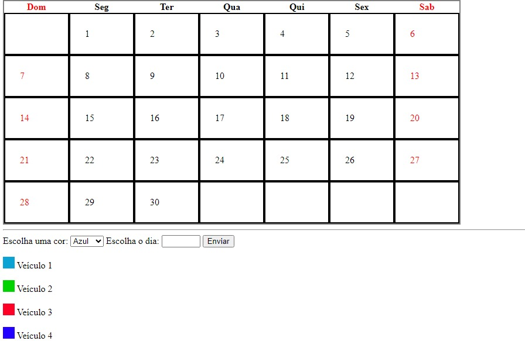
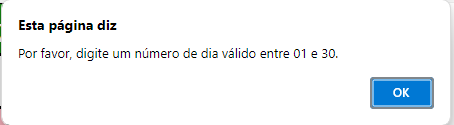

# calendario-git

 # sobre 
 Esse trabalho foi feito em html e javascript na disciplina de Programação Web I, envolve um calendario para fretamentos  

 # funcionalidade
 * Marcação de dias no calendário para agendamento de fretes.
* Atribuição de cores aos dias conforme o veículo responsável pelo frete.
* Legenda para identificação das cores dos veículos.
* Restrições de agendamento respeitadas: cada veículo pode fazer no máximo um frete por dia e três fretes por mês.
* Interface amigável e responsiva, desenvolvida com HTML5 e estilizada com CSS3.
 # analise do codigo
  [calendario.html](/calendario.html) 
 [calendar.js](/calendar.js) 
 [calendar.css](/calendar.css) 

# Tecnologias utilizadas
* ✅  HTML5
* ✅  CSS3
* ✅  javascript
* ✅  Visual Studio Code 
* ✅  Git 
* ✅  GitHub

# Autores
 * pessoas que me ajudou a criar o calendario 
 
<https://github.com/mariayanagui> 
<https://github.com/LeonardoRochaMarista>  
<https://github.com/queijitos>  